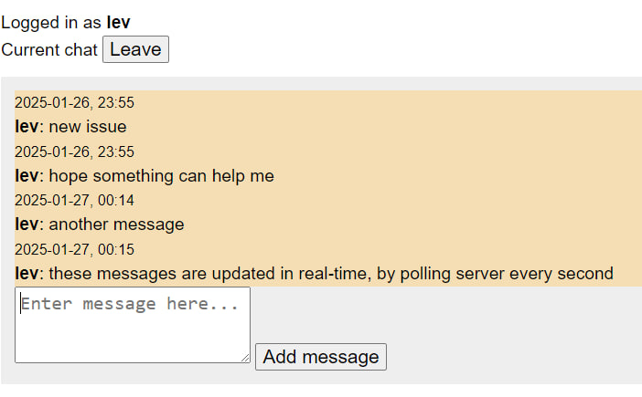
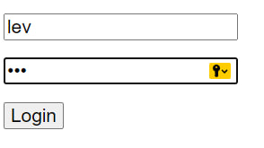

# 🩺 med-app-pet-project

  

### A fully async python web application for doctor - client communication

#### [Overview](#overview)
#### [Installation](#installation)

### Overview

REST API built in python 3.12 with fastapi. Uses MySQL for storing.
Client receives updates through polling, written in js.

#### chat:


#### login:


## Installation

#### Install and run on your machine:

1) Clone this repo:

```shell
git clone https://github.com/LevLobanov/med-app-pet-project.git
```

2) Make python 3.12 virtual environment:

```shell
python3.12 -m venv .venv
```

3) Start venv:

win:
```shell
./.venv/Scripts/acitvate
```
linux:
```shell
source ./.venv/bin/activate
```

4) Install dependencies:

win:
```shell
pip install -r requirements.txt
```

linux:
```shell
pip3 install -r requirements.txt
```

5) Create .env file:
```env
# .env file example

secret_key = "secret key"

mysql_user = "root"
mysql_password = "password"
mysql_host = "127.0.0.1"
mysql_port = 3306

doctor_username = "doctor"
doctor_password = "docpass"
```

6) Run application:

```shell
python3.12 main.py
```